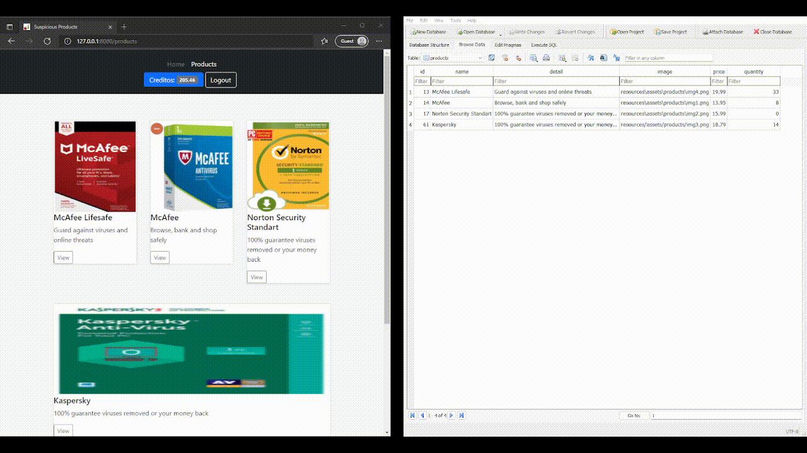
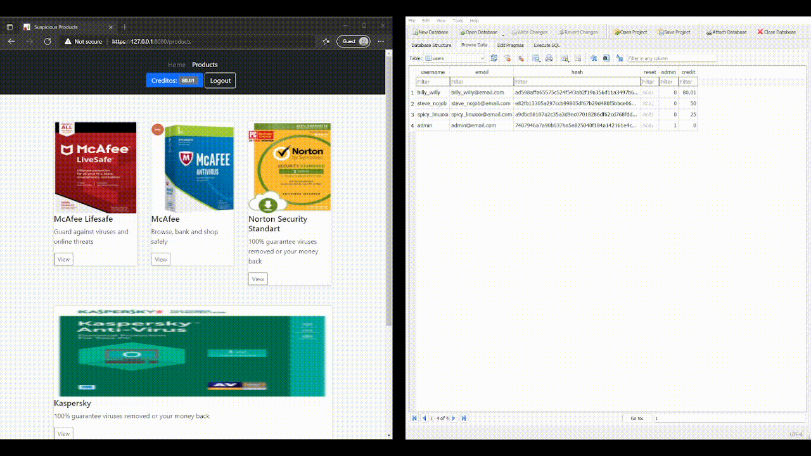

# CWE-20: Improper Input Validation

## Index
The analysis of the implementation of this vulnerability is divided in the following sections:

1. [Explanation](#explanation)
2. [Implementation](#implementation)
    - [Posssible exploitation](#posssible-exploitation)
4. [Mitigation](#mitigation)
5. [Examples](#examples)

## Explanation

- What is [CWE-20](https://cwe.mitre.org/data/definitions/20.html)

> *The product receives input or data, but it does not validate or incorrectly validates that the input has the properties that are required to process the data safely and correctly.*
> 
> by **Common Weakness Enumeration**

In other words, CWE-20 can comprehend every type of user input that is not properly sanitized or protected against user error of misuse.

When the input of a user can be crafted to attain a certain objective or behavior that the application does not see as incorrect but can affect the rest of the application

## Implementation

- **How** it was implemented  

Taking the example from the [CWE-20](https://cwe.mitre.org/data/definitions/20.html), and because it fitted the concept of the this project, this vulnerability takes advantage of the input for the **quantity** of products that a user pretends to buy from the store not being sanitized, and thus not being able to deal **correctly** with **negative** values  

When a user wants to specify the quantity of the product he/she wants to buy, this is the HTML code of the form that receives that input

``` html
<label for="quantity" class="form-label">Quantidade</label>
<input type="number" class="form-control" id="quantity">
```

After specifying the quantity, when **clicking the buy** button the following **Javascript** function will get triggered. This function on the **client** side is reponsible for retrieving the input from the HTML form and passing it, via **AJAX** in a **POST** request, to the **server** side

```javascript
function buy() {
    var queryString = window.location.search;
    var urlParams = new URLSearchParams(queryString);
    item_id = urlParams.get("id");

    var quantity = $("#quantity").val();  // <-- !!!
    var qmax = document.getElementById("quantity").max;
    var price = $("#price").val();
    var credits = $("#credits").val();
    
    if (value > credits) {
        swal("Credito insuficiente", "", "error");
    }else {
        
        var value = (quantity * price); // <-- !!!
        data = {"value": encode64(value), "product_id": encode64(item_id), "quantity": encode64(quantity) };
        $.ajax({
            type: "POST",
            url: "buy",
            data: JSON.stringify(data),
            contentType: "application/json",
            dataType: "json",
            success: function (data) {
                response = jQuery.parseJSON(data);
                if (response.success) {
                    swal(response.message, "", "success");
                    var nv = credits - value; // <-- !!
                    sessionStorage.setItem("credit", nv.toFixed(2));
                } else {
                    swal(response.message, "", "error");
                }
            }
        });
    }
}
```
This POST request will be **received** by the follwing Python code, in the server side, that handle the **SQL database**, modifying both **users** and **products** tables, by updating the available **credit** of the user, and the **stock** of the purchase product, respectively.

```python
@cherrypy.expose
    @cherrypy.tools.json_out()
    @cherrypy.tools.json_in()
    def buy(self):
        input = cherrypy.request.json

        value = decode64(input["value"])
        username = cherrypy.session[cherrypy.session.id]

        product_id = decode64(input["product_id"])
        quantity = decode64(input["quantity"])  # <-- !!!

        db = sqlite3.connect("database.db")
        cur = db.cursor()

        # Product update
        com = """ SELECT quantity FROM products WHERE id=? """
        arg = (product_id,)
        match = cur.execute(com, arg)
        old_quantity = match.fetchone()[0]

        new_quantity = old_quantity - int(quantity) # <-- !!!

        com = """UPDATE products SET quantity=? WHERE id=?"""
        arg = (new_quantity, product_id)  # <-- !!!
        cur.execute(com, arg)

        # User update
        com = """ SELECT credit FROM users WHERE username=? """
        arg = (username,)
        match = cur.execute(com, arg)
        old_credit = match.fetchone()[0]

        new_credit = round(old_credit - float(value), 2)  # <-- !!!

        com = """ UPDATE users SET credit=? WHERE username=? """
        arg = (new_credit, username)  # <-- !!!
        cur.execute(com, arg)

        db.commit()
        db.close()

        response = {"success": 1,
                    "message": "Produto adquirido e valor deduzido do credito"}
        return json.dumps(response)
```

This said, lets take a look to the HTML code first.

As we can see, in the input tag
```html 
<input type="number" class="form-control" id="quantity">
``` 
it is only specified the **type**, **class** and **id**. If we research for the parameters that this tag is able to take, we can see that we can also specify the **max** and **min** value that this field can accept.

**BUT** this in it self is an imperfect solution, because the **only thing** that this field prevent is the input via UP and DOWN arrows of the keyboard but **does not** prevent the **manual** input by the user.

Taking this detail in consideration, using **max** and **min** will not help if we continue to use the **buy()** function as we do above.

More specifically, lets take a look to the commented lines with *<-- !!*, witch are:

1.
```javascript 
var quantity = $("#quantity").val();
```
2.
```javascript 
var value = (quantity * price);
```
3.
```javascript
var nv = credits - value; // <-- !!
```

By not sanatizing one, or both, of the *1* and *2* pieces of code, we run the risk of passing negative values in the POST resquest to the server side. And in *3*, although not a critical vulnerabily since it only affects the value displayed to the client, we can misinform the user of he/she current credit.

### Posssible exploitation

One possible exploitation for this vulnerability is, not only, a user can get an unlimited amount of credit "purchasing" items at the store, but, by interfering with the value of the quantity, wich is **directly** linked with the **amount of stock** of that item on the **database**, it can cause significant damage to the management of stock by the store. 

Soo, how do we **prevent** it ?

## Mitigation

The mitigation however, in this particular case, its particularly simple, only requiering that the programmer makes sure to sanitize every value to it's **absolute** value, since there can't be **negative quantities** or **negative credit**

We should do this is **both**, **cliente** and **server** side just to be sure. This said the code will suffer the following transformations:

- On the **client side**, the Javascript vulnerable piece of code goes from this:
```javascript 
// VULNERABLE 
var quantity = $("#quantity").val();

To this ⬇️

// SAFE
var quantity = Math.abs(parseInt($("#quantity").val()));
```

- On the **server side**, the Python vulnerable pieces of code go from this:
```python
// VULNERABLE 
new_quantity = old_quantity - int(quantity)

To this ⬇️

// SAFE
 new_quantity = old_quantity - abs(int(quantity))
```

And just to be extra safe, it goes from this:
```python
// VULNERABLE 
new_credit = round(old_credit - float(value), 2)

To this ⬇️

// SAFE
new_credit = round(old_credit - abs(float(value)), 2)
```

## Examples

### Vulnerable
Bellow you can watch a little video (in GIF format, you may have to wait until it loops to the start) where you can clearly see that when a negative value in inputted in the quantity form field, not only the user credit **increases after** the purchase, both in client side **and** server side in the SQL table; but also you can watch the quantity in stock of the purchased item also **increases** 



---

### Safe
In contrast, the safe version, by only assuming absolute values, both **credit** of the user and **quantity** in stock of the purchased item decrease


